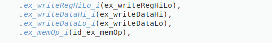
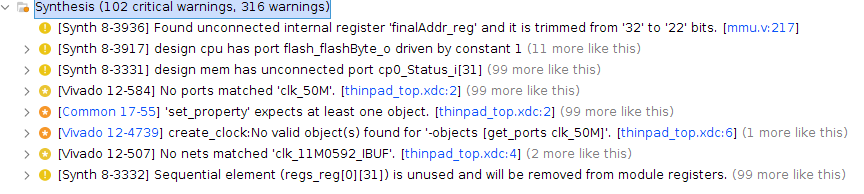

# RESULT

## 1. 功能性

#### CPU_sample

1.本项目

ex_mem signal list:

````
INFO> ex_mem signal list:
writeData INTERNAL Wire, Dependency: 0 writeData_o, 

insAddr INTERNAL Wire, Dependency: 0 insAddr_o, 

storeData INTERNAL Wire, Dependency: 0 storeData_o, 

ramOp INTERNAL Wire, Dependency: 0 memOp_o, 

writeReg INTERNAL Wire, Dependency: 0 writeReg_o, 

writeRegAddr INTERNAL Wire, Dependency: 0 writeRegAddr_o, 

writeDataHi INTERNAL Wire, Dependency: 0 writeDataHi_o, 

writeDataLo INTERNAL Wire, Dependency: 0 writeDataLo_o, 

writeRegHiLo INTERNAL Wire, Dependency: 0 writeRegHiLo_o, 

writeCP0 INTERNAL Wire, Dependency: 0 writeCP0_o, 

writeCP0Addr INTERNAL Wire, Dependency: 0 writeCP0Addr_o, 

insValid INTERNAL Wire, Dependency: 0 insValid_o, 

inDelaySlot INTERNAL Wire, Dependency: 0 inDelaySlot_o, 

exception INTERNAL Wire, Dependency: 0 exception_o, 

badVAddr INTERNAL Wire, Dependency: 0 badVAddr_o, 

clk INPUT Wire, Comment: clock, Dependency: 

rst INPUT Wire, Comment: reset, Dependency: 

writeData_i INPUT Wire, Dependency: 

insAddr_i INPUT Wire, Dependency: 

storeData_i INPUT Wire, Dependency: 

memOp_i INPUT Wire, Dependency: 

writeReg_i INPUT Wire, Dependency: 

writeRegAddr_i INPUT Wire, Dependency: 

writeDataHi_i INPUT Wire, Dependency: 

writeDataLo_i INPUT Wire, Dependency: 

writeRegHiLo_i INPUT Wire, Dependency: 

writeCP0_i INPUT Wire, Dependency: 

writeCP0Addr_i INPUT Wire, Dependency: 

insValid_i INPUT Wire, Comment: in_signal, Dependency: 

inDelaySlot_i INPUT Wire, Dependency: 

exception_i INPUT Wire, Dependency: 

badVAddr_i INPUT Wire, Dependency: 

pauseControl_i INPUT Wire, Dependency: 

flush_i INPUT Wire, Dependency: 

writeData_o OUTPUT Reg, Comment: out_signal, Dependency: 1 clk, 0 rst, 0 writeData, 0 pauseControl_i, 0 flush_i, 0 writeData_i, 

insAddr_o OUTPUT Reg, Comment: out_signal, Dependency: 1 clk, 0 rst, 0 insAddr, 0 pauseControl_i, 0 flush_i, 0 insAddr_i, 

storeData_o OUTPUT Reg, Comment: out_signal, Dependency: 1 clk, 0 rst, 0 storeData, 0 pauseControl_i, 0 flush_i, 0 storeData_i, 

memOp_o OUTPUT Reg, Comment: out_signal, Dependency: 1 clk, 0 rst, 0 ramOp, 0 pauseControl_i, 0 flush_i, 0 memOp_i, 

writeReg_o OUTPUT Reg, Comment: out_signal, Dependency: 1 clk, 0 rst, 0 writeReg, 0 pauseControl_i, 0 flush_i, 0 writeReg_i, 

writeRegAddr_o OUTPUT Reg, Comment: out_signal, Dependency: 1 clk, 0 rst, 0 writeRegAddr, 0 pauseControl_i, 0 flush_i, 0 writeRegAddr_i, 

writeDataHi_o OUTPUT Reg, Comment: out_signal, Dependency: 1 clk, 0 rst, 0 writeDataHi, 0 pauseControl_i, 0 flush_i, 0 writeDataHi_i, 

writeDataLo_o OUTPUT Reg, Comment: out_signal, Dependency: 1 clk, 0 rst, 0 writeDataLo, 0 pauseControl_i, 0 flush_i, 0 writeDataLo_i, 

writeRegHiLo_o OUTPUT Reg, Comment: out_signal, Dependency: 1 clk, 0 rst, 0 writeRegHiLo, 0 pauseControl_i, 0 flush_i, 0 writeRegHiLo_i, 

writeCP0_o OUTPUT Reg, Comment: out_signal, Dependency: 1 clk, 0 rst, 0 writeCP0, 0 pauseControl_i, 0 flush_i, 0 writeCP0_i, 

writeCP0Addr_o OUTPUT Reg, Comment: out_signal, Dependency: 1 clk, 0 rst, 0 writeCP0Addr, 0 pauseControl_i, 0 flush_i, 0 writeCP0Addr_i, 

insValid_o OUTPUT Reg, Comment: out_signal, Dependency: 1 clk, 0 rst, 0 insValid, 0 pauseControl_i, 0 flush_i, 0 insValid_i, 

inDelaySlot_o OUTPUT Reg, Comment: out_signal, Dependency: 1 clk, 0 rst, 0 inDelaySlot, 0 pauseControl_i, 0 flush_i, 0 inDelaySlot_i, 

exception_o OUTPUT Reg, Comment: out_signal, Dependency: 1 clk, 0 rst, 0 exception, 0 pauseControl_i, 0 flush_i, 0 exception_i, 

badVAddr_o OUTPUT Reg, Comment: out_signal, Dependency: 1 clk, 0 rst, 0 badVAddr, 0 pauseControl_i, 0 flush_i, 0 badVAddr_i
````


CPU/pc.v和CPU/if_id.v 中, 按照设计文档的定义, bubble_i 应该是来自 ex段的信号,但代码逻辑中是来自 id模块

CPU/id.v 中, 按照接口文档中的定义,  `ex_writeRegHiLo_i,`, `ex_writeDataHi_i`, `ex_writeDataLo_i`和`ex_memOp_i`都是从ex通过旁路返回的信号, 按照文档中的定义标注之后, 项目发现  `id.ex_memOp_i`的依赖关系错误, 查看`cpu.v`之后发现`ex_memOp_i`和文档描述相冲突. 而这是其他lint工具无法发现的.




2.verilator

````
%Warning-DECLFILENAME: /home/mason/Desktop/work/verilog-parser/tests/CPU_sample/Uncommented/thinpad_top/thinpad_top.srcs/sources_1/new/async.v:13: Filename 'async' does not match MODULE name: async_transmitter
%Warning-DECLFILENAME: Use "/* verilator lint_off DECLFILENAME */" and lint_on around source to disable this message.
%Warning-VARHIDDEN: /home/mason/Desktop/work/verilog-parser/tests/CPU_sample/Uncommented/thinpad_top/thinpad_top.srcs/sources_1/new/mmu.v:224: Declaration of signal hides declaration in upper scope: i
%Warning-VARHIDDEN: /home/mason/Desktop/work/verilog-parser/tests/CPU_sample/Uncommented/thinpad_top/thinpad_top.srcs/sources_1/new/mmu.v:99: ... Location of original declaration
%Warning-WIDTH: /home/mason/Desktop/work/verilog-parser/tests/CPU_sample/Uncommented/thinpad_top/thinpad_top.srcs/sources_1/new/async.v:131: Logical Operator WHILE expects 1 bit on the For Test Condition, but For Test Condition's SHIFTR generates 32 bits.
%Warning-WIDTH: /home/mason/Desktop/work/verilog-parser/tests/CPU_sample/Uncommented/thinpad_top/thinpad_top.srcs/sources_1/new/async.v:194: Logical Operator WHILE expects 1 bit on the For Test Condition, but For Test Condition's SHIFTR generates 32 bits.
%Warning-WIDTH: /home/mason/Desktop/work/verilog-parser/tests/CPU_sample/Uncommented/thinpad_top/thinpad_top.srcs/sources_1/new/async.v:134: Operator COND expects 3 bits on the Conditional True, but Conditional True's CONST '1'h0' generates 1 bits.
%Warning-WIDTH: /home/mason/Desktop/work/verilog-parser/tests/CPU_sample/Uncommented/thinpad_top/thinpad_top.srcs/sources_1/new/async.v:135: Operator EQ expects 32 or 4 bits on the LHS, but LHS's VARREF 'OversamplingCnt' generates 3 bits.
%Warning-WIDTH: /home/mason/Desktop/work/verilog-parser/tests/CPU_sample/Uncommented/thinpad_top/thinpad_top.srcs/sources_1/new/mem_wb.v:66: Operator ASSIGNDLY expects 5 bits on the Assign RHS, but Assign RHS's CONST '32'h0' generates 32 bits.
%Warning-WIDTH: /home/mason/Desktop/work/verilog-parser/tests/CPU_sample/Uncommented/thinpad_top/thinpad_top.srcs/sources_1/new/ex_mem.v:100: Operator ASSIGNDLY expects 5 bits on the Assign RHS, but Assign RHS's CONST '32'h0' generates 32 bits.
%Warning-WIDTH: /home/mason/Desktop/work/verilog-parser/tests/CPU_sample/Uncommented/thinpad_top/thinpad_top.srcs/sources_1/new/ex_mem.v:150: Operator ASSIGNDLY expects 5 bits on the Assign RHS, but Assign RHS's CONST '32'h0' generates 32 bits.
%Warning-WIDTH: /home/mason/Desktop/work/verilog-parser/tests/CPU_sample/Uncommented/thinpad_top/thinpad_top.srcs/sources_1/new/id.v:208: Operator ASSIGN expects 5 bits on the Assign RHS, but Assign RHS's CONST '32'h0' generates 32 bits.
%Warning-WIDTH: /home/mason/Desktop/work/verilog-parser/tests/CPU_sample/Uncommented/thinpad_top/thinpad_top.srcs/sources_1/new/id.v:209: Operator ASSIGN expects 5 bits on the Assign RHS, but Assign RHS's CONST '32'h0' generates 32 bits.
%Warning-UNUSED: /home/mason/Desktop/work/verilog-parser/tests/CPU_sample/Uncommented/thinpad_top/thinpad_top.srcs/sources_1/new/mem.v:37: Bits of signal are not used: cp0_Status_i[31:23,21:16,7:5,3]
%Warning-UNUSED: /home/mason/Desktop/work/verilog-parser/tests/CPU_sample/Uncommented/thinpad_top/thinpad_top.srcs/sources_1/new/mem.v:38: Signal is not used: cp0_EntryHi_i
%Warning-UNUSED: /home/mason/Desktop/work/verilog-parser/tests/CPU_sample/Uncommented/thinpad_top/thinpad_top.srcs/sources_1/new/mem.v:75: Signal is not used: BEV
%Warning-UNUSED: /home/mason/Desktop/work/verilog-parser/tests/CPU_sample/Uncommented/thinpad_top/thinpad_top.srcs/sources_1/new/mmu.v:20: Bits of signal are not used: cp0_Status_i[31:5,3,0]
%Warning-UNUSED: /home/mason/Desktop/work/verilog-parser/tests/CPU_sample/Uncommented/thinpad_top/thinpad_top.srcs/sources_1/new/mmu.v:22: Bits of signal are not used: cp0_Index_i[31:4]
%Warning-UNUSED: /home/mason/Desktop/work/verilog-parser/tests/CPU_sample/Uncommented/thinpad_top/thinpad_top.srcs/sources_1/new/mmu.v:23: Bits of signal are not used: cp0_EntryLo0_i[31:26,5:3]
%Warning-UNUSED: /home/mason/Desktop/work/verilog-parser/tests/CPU_sample/Uncommented/thinpad_top/thinpad_top.srcs/sources_1/new/mmu.v:24: Bits of signal are not used: cp0_EntryLo1_i[31:26,5:3]
%Warning-UNUSED: /home/mason/Desktop/work/verilog-parser/tests/CPU_sample/Uncommented/thinpad_top/thinpad_top.srcs/sources_1/new/mmu.v:25: Bits of signal are not used: cp0_EntryHi_i[12:8]
%Warning-UNUSED: /home/mason/Desktop/work/verilog-parser/tests/CPU_sample/Uncommented/thinpad_top/thinpad_top.srcs/sources_1/new/mmu.v:71: Bits of signal are not used: addr_serial[2:0]
%Warning-UNUSED: /home/mason/Desktop/work/verilog-parser/tests/CPU_sample/Uncommented/thinpad_top/thinpad_top.srcs/sources_1/new/mmu.v:108: Bits of signal are not used: finalAddr[31:22,1:0]
%Warning-UNOPTFLAT: /home/mason/Desktop/work/verilog-parser/tests/CPU_sample/Uncommented/thinpad_top/thinpad_top.srcs/sources_1/new/cpu.v:100: Signal unoptimizable: Feedback to clock or circular logic: cpu.id_CP0ReadEnable
%Warning-UNOPTFLAT:      Example path: /home/mason/Desktop/work/verilog-parser/tests/CPU_sample/Uncommented/thinpad_top/thinpad_top.srcs/sources_1/new/cpu.v:100:  cpu.id_CP0ReadEnable
%Warning-UNOPTFLAT:      Example path: /home/mason/Desktop/work/verilog-parser/tests/CPU_sample/Uncommented/thinpad_top/thinpad_top.srcs/sources_1/new/id.v:141:  ALWAYS
%Warning-UNOPTFLAT:      Example path: /home/mason/Desktop/work/verilog-parser/tests/CPU_sample/Uncommented/thinpad_top/thinpad_top.srcs/sources_1/new/id.v:140:  cpu.ID.CP0Data
%Warning-UNOPTFLAT:      Example path: /home/mason/Desktop/work/verilog-parser/tests/CPU_sample/Uncommented/thinpad_top/thinpad_top.srcs/sources_1/new/id.v:208:  ALWAYS
%Warning-UNOPTFLAT:      Example path: /home/mason/Desktop/work/verilog-parser/tests/CPU_sample/Uncommented/thinpad_top/thinpad_top.srcs/sources_1/new/cpu.v:100:  cpu.id_CP0ReadEnable
%Warning-UNOPTFLAT: /home/mason/Desktop/work/verilog-parser/tests/CPU_sample/Uncommented/thinpad_top/thinpad_top.srcs/sources_1/new/cpu.v:101: Signal unoptimizable: Feedback to clock or circular logic: cpu.id_CP0ReadAddr
%Warning-UNOPTFLAT:      Example path: /home/mason/Desktop/work/verilog-parser/tests/CPU_sample/Uncommented/thinpad_top/thinpad_top.srcs/sources_1/new/cpu.v:101:  cpu.id_CP0ReadAddr
%Warning-UNOPTFLAT:      Example path: /home/mason/Desktop/work/verilog-parser/tests/CPU_sample/Uncommented/thinpad_top/thinpad_top.srcs/sources_1/new/id.v:141:  ALWAYS
%Warning-UNOPTFLAT:      Example path: /home/mason/Desktop/work/verilog-parser/tests/CPU_sample/Uncommented/thinpad_top/thinpad_top.srcs/sources_1/new/id.v:140:  cpu.ID.CP0Data
%Warning-UNOPTFLAT:      Example path: /home/mason/Desktop/work/verilog-parser/tests/CPU_sample/Uncommented/thinpad_top/thinpad_top.srcs/sources_1/new/id.v:208:  ALWAYS
%Warning-UNOPTFLAT:      Example path: /home/mason/Desktop/work/verilog-parser/tests/CPU_sample/Uncommented/thinpad_top/thinpad_top.srcs/sources_1/new/cpu.v:101:  cpu.id_CP0ReadAddr
%Warning-UNOPTFLAT: /home/mason/Desktop/work/verilog-parser/tests/CPU_sample/Uncommented/thinpad_top/thinpad_top.srcs/sources_1/new/cpu.v:79: Signal unoptimizable: Feedback to clock or circular logic: cpu.serialcontrol_ramData
%Warning-UNOPTFLAT:      Example path: /home/mason/Desktop/work/verilog-parser/tests/CPU_sample/Uncommented/thinpad_top/thinpad_top.srcs/sources_1/new/cpu.v:79:  cpu.serialcontrol_ramData
%Warning-UNOPTFLAT:      Example path: /home/mason/Desktop/work/verilog-parser/tests/CPU_sample/Uncommented/thinpad_top/thinpad_top.srcs/sources_1/new/mmu.v:258:  ALWAYS
%Warning-UNOPTFLAT:      Example path: /home/mason/Desktop/work/verilog-parser/tests/CPU_sample/Uncommented/thinpad_top/thinpad_top.srcs/sources_1/new/cpu.v:210:  cpu.mmu_serial_ramOp
%Warning-UNOPTFLAT:      Example path: /home/mason/Desktop/work/verilog-parser/tests/CPU_sample/Uncommented/thinpad_top/thinpad_top.srcs/sources_1/new/serialcontrol.v:37:  ASSIGNW
%Warning-UNOPTFLAT:      Example path: /home/mason/Desktop/work/verilog-parser/tests/CPU_sample/Uncommented/thinpad_top/thinpad_top.srcs/sources_1/new/serialcontrol.v:37:  cpu.SerialControl.serialRead
%Warning-UNOPTFLAT:      Example path: /home/mason/Desktop/work/verilog-parser/tests/CPU_sample/Uncommented/thinpad_top/thinpad_top.srcs/sources_1/new/serialcontrol.v:94:  ALWAYS
%Warning-UNOPTFLAT:      Example path: /home/mason/Desktop/work/verilog-parser/tests/CPU_sample/Uncommented/thinpad_top/thinpad_top.srcs/sources_1/new/serialcontrol.v:32:  cpu.SerialControl.ramData
%Warning-UNOPTFLAT:      Example path: /home/mason/Desktop/work/verilog-parser/tests/CPU_sample/Uncommented/thinpad_top/thinpad_top.srcs/sources_1/new/serialcontrol.v:41:  ASSIGNW
%Warning-UNOPTFLAT:      Example path: /home/mason/Desktop/work/verilog-parser/tests/CPU_sample/Uncommented/thinpad_top/thinpad_top.srcs/sources_1/new/cpu.v:79:  cpu.serialcontrol_ramData
%Warning-UNOPTFLAT: /home/mason/Desktop/work/verilog-parser/tests/CPU_sample/Uncommented/thinpad_top/thinpad_top.srcs/sources_1/new/cpu.v:207: Signal unoptimizable: Feedback to clock or circular logic: cpu.mmu_rom_ramAddr
%Warning-UNOPTFLAT:      Example path: /home/mason/Desktop/work/verilog-parser/tests/CPU_sample/Uncommented/thinpad_top/thinpad_top.srcs/sources_1/new/cpu.v:207:  cpu.mmu_rom_ramAddr
%Warning-UNOPTFLAT:      Example path: /home/mason/Desktop/work/verilog-parser/tests/CPU_sample/Uncommented/thinpad_top/thinpad_top.srcs/sources_1/new/rom.v:8:  ALWAYS
%Warning-UNOPTFLAT:      Example path: /home/mason/Desktop/work/verilog-parser/tests/CPU_sample/Uncommented/thinpad_top/thinpad_top.srcs/sources_1/new/cpu.v:83:  cpu.rom_ins
%Warning-UNOPTFLAT:      Example path: /home/mason/Desktop/work/verilog-parser/tests/CPU_sample/Uncommented/thinpad_top/thinpad_top.srcs/sources_1/new/mmu.v:258:  ALWAYS
%Warning-UNOPTFLAT:      Example path: /home/mason/Desktop/work/verilog-parser/tests/CPU_sample/Uncommented/thinpad_top/thinpad_top.srcs/sources_1/new/cpu.v:207:  cpu.mmu_rom_ramAddr
%Warning-UNOPTFLAT: /home/mason/Desktop/work/verilog-parser/tests/CPU_sample/Uncommented/thinpad_top/thinpad_top.srcs/sources_1/new/cpu.v:205: Signal unoptimizable: Feedback to clock or circular logic: cpu.mmu_sram_storeData
%Warning-UNOPTFLAT:      Example path: /home/mason/Desktop/work/verilog-parser/tests/CPU_sample/Uncommented/thinpad_top/thinpad_top.srcs/sources_1/new/cpu.v:205:  cpu.mmu_sram_storeData
%Warning-UNOPTFLAT:      Example path: /home/mason/Desktop/work/verilog-parser/tests/CPU_sample/Uncommented/thinpad_top/thinpad_top.srcs/sources_1/new/cpu.v:12:  ASSIGNW
%Warning-UNOPTFLAT:      Example path: /home/mason/Desktop/work/verilog-parser/tests/CPU_sample/Uncommented/thinpad_top/thinpad_top.srcs/sources_1/new/cpu.v:12:  sram_data_io
%Warning-UNOPTFLAT:      Example path: /home/mason/Desktop/work/verilog-parser/tests/CPU_sample/Uncommented/thinpad_top/thinpad_top.srcs/sources_1/new/mmu.v:258:  ALWAYS
%Warning-UNOPTFLAT:      Example path: /home/mason/Desktop/work/verilog-parser/tests/CPU_sample/Uncommented/thinpad_top/thinpad_top.srcs/sources_1/new/cpu.v:205:  cpu.mmu_sram_storeData
%Warning-UNOPTFLAT: /home/mason/Desktop/work/verilog-parser/tests/CPU_sample/Uncommented/thinpad_top/thinpad_top.srcs/sources_1/new/cpu.v:96: Signal unoptimizable: Feedback to clock or circular logic: cpu.id_regReadAddr1
%Warning-UNOPTFLAT:      Example path: /home/mason/Desktop/work/verilog-parser/tests/CPU_sample/Uncommented/thinpad_top/thinpad_top.srcs/sources_1/new/cpu.v:96:  cpu.id_regReadAddr1
%Warning-UNOPTFLAT:      Example path: /home/mason/Desktop/work/verilog-parser/tests/CPU_sample/Uncommented/thinpad_top/thinpad_top.srcs/sources_1/new/registers.v:24:  ALWAYS
%Warning-UNOPTFLAT:      Example path: /home/mason/Desktop/work/verilog-parser/tests/CPU_sample/Uncommented/thinpad_top/thinpad_top.srcs/sources_1/new/cpu.v:37:  cpu.reg_data1
%Warning-UNOPTFLAT:      Example path: /home/mason/Desktop/work/verilog-parser/tests/CPU_sample/Uncommented/thinpad_top/thinpad_top.srcs/sources_1/new/id.v:157:  ALWAYS
%Warning-UNOPTFLAT:      Example path: /home/mason/Desktop/work/verilog-parser/tests/CPU_sample/Uncommented/thinpad_top/thinpad_top.srcs/sources_1/new/id.v:151:  cpu.ID.regData1
%Warning-UNOPTFLAT:      Example path: /home/mason/Desktop/work/verilog-parser/tests/CPU_sample/Uncommented/thinpad_top/thinpad_top.srcs/sources_1/new/id.v:208:  ALWAYS
%Warning-UNOPTFLAT:      Example path: /home/mason/Desktop/work/verilog-parser/tests/CPU_sample/Uncommented/thinpad_top/thinpad_top.srcs/sources_1/new/cpu.v:96:  cpu.id_regReadAddr1
%Warning-UNOPTFLAT: /home/mason/Desktop/work/verilog-parser/tests/CPU_sample/Uncommented/thinpad_top/thinpad_top.srcs/sources_1/new/cpu.v:98: Signal unoptimizable: Feedback to clock or circular logic: cpu.id_regEnable1
%Warning-UNOPTFLAT:      Example path: /home/mason/Desktop/work/verilog-parser/tests/CPU_sample/Uncommented/thinpad_top/thinpad_top.srcs/sources_1/new/cpu.v:98:  cpu.id_regEnable1
%Warning-UNOPTFLAT:      Example path: /home/mason/Desktop/work/verilog-parser/tests/CPU_sample/Uncommented/thinpad_top/thinpad_top.srcs/sources_1/new/registers.v:24:  ALWAYS
%Warning-UNOPTFLAT:      Example path: /home/mason/Desktop/work/verilog-parser/tests/CPU_sample/Uncommented/thinpad_top/thinpad_top.srcs/sources_1/new/cpu.v:37:  cpu.reg_data1
%Warning-UNOPTFLAT:      Example path: /home/mason/Desktop/work/verilog-parser/tests/CPU_sample/Uncommented/thinpad_top/thinpad_top.srcs/sources_1/new/id.v:157:  ALWAYS
%Warning-UNOPTFLAT:      Example path: /home/mason/Desktop/work/verilog-parser/tests/CPU_sample/Uncommented/thinpad_top/thinpad_top.srcs/sources_1/new/id.v:151:  cpu.ID.regData1
%Warning-UNOPTFLAT:      Example path: /home/mason/Desktop/work/verilog-parser/tests/CPU_sample/Uncommented/thinpad_top/thinpad_top.srcs/sources_1/new/id.v:208:  ALWAYS
%Warning-UNOPTFLAT:      Example path: /home/mason/Desktop/work/verilog-parser/tests/CPU_sample/Uncommented/thinpad_top/thinpad_top.srcs/sources_1/new/cpu.v:98:  cpu.id_regEnable1
%Warning-UNOPTFLAT: /home/mason/Desktop/work/verilog-parser/tests/CPU_sample/Uncommented/thinpad_top/thinpad_top.srcs/sources_1/new/cpu.v:97: Signal unoptimizable: Feedback to clock or circular logic: cpu.id_regReadAddr2
%Warning-UNOPTFLAT:      Example path: /home/mason/Desktop/work/verilog-parser/tests/CPU_sample/Uncommented/thinpad_top/thinpad_top.srcs/sources_1/new/cpu.v:97:  cpu.id_regReadAddr2
%Warning-UNOPTFLAT:      Example path: /home/mason/Desktop/work/verilog-parser/tests/CPU_sample/Uncommented/thinpad_top/thinpad_top.srcs/sources_1/new/registers.v:37:  ALWAYS
%Warning-UNOPTFLAT:      Example path: /home/mason/Desktop/work/verilog-parser/tests/CPU_sample/Uncommented/thinpad_top/thinpad_top.srcs/sources_1/new/cpu.v:38:  cpu.reg_data2
%Warning-UNOPTFLAT:      Example path: /home/mason/Desktop/work/verilog-parser/tests/CPU_sample/Uncommented/thinpad_top/thinpad_top.srcs/sources_1/new/id.v:170:  ALWAYS
%Warning-UNOPTFLAT:      Example path: /home/mason/Desktop/work/verilog-parser/tests/CPU_sample/Uncommented/thinpad_top/thinpad_top.srcs/sources_1/new/id.v:152:  cpu.ID.regData2
%Warning-UNOPTFLAT:      Example path: /home/mason/Desktop/work/verilog-parser/tests/CPU_sample/Uncommented/thinpad_top/thinpad_top.srcs/sources_1/new/id.v:208:  ALWAYS
%Warning-UNOPTFLAT:      Example path: /home/mason/Desktop/work/verilog-parser/tests/CPU_sample/Uncommented/thinpad_top/thinpad_top.srcs/sources_1/new/cpu.v:97:  cpu.id_regReadAddr2
%Warning-UNOPTFLAT: /home/mason/Desktop/work/verilog-parser/tests/CPU_sample/Uncommented/thinpad_top/thinpad_top.srcs/sources_1/new/cpu.v:99: Signal unoptimizable: Feedback to clock or circular logic: cpu.id_regEnable2
%Warning-UNOPTFLAT:      Example path: /home/mason/Desktop/work/verilog-parser/tests/CPU_sample/Uncommented/thinpad_top/thinpad_top.srcs/sources_1/new/cpu.v:99:  cpu.id_regEnable2
%Warning-UNOPTFLAT:      Example path: /home/mason/Desktop/work/verilog-parser/tests/CPU_sample/Uncommented/thinpad_top/thinpad_top.srcs/sources_1/new/registers.v:37:  ALWAYS
%Warning-UNOPTFLAT:      Example path: /home/mason/Desktop/work/verilog-parser/tests/CPU_sample/Uncommented/thinpad_top/thinpad_top.srcs/sources_1/new/cpu.v:38:  cpu.reg_data2
%Warning-UNOPTFLAT:      Example path: /home/mason/Desktop/work/verilog-parser/tests/CPU_sample/Uncommented/thinpad_top/thinpad_top.srcs/sources_1/new/id.v:170:  ALWAYS
%Warning-UNOPTFLAT:      Example path: /home/mason/Desktop/work/verilog-parser/tests/CPU_sample/Uncommented/thinpad_top/thinpad_top.srcs/sources_1/new/id.v:152:  cpu.ID.regData2
%Warning-UNOPTFLAT:      Example path: /home/mason/Desktop/work/verilog-parser/tests/CPU_sample/Uncommented/thinpad_top/thinpad_top.srcs/sources_1/new/id.v:208:  ALWAYS
%Warning-UNOPTFLAT:      Example path: /home/mason/Desktop/work/verilog-parser/tests/CPU_sample/Uncommented/thinpad_top/thinpad_top.srcs/sources_1/new/cpu.v:99:  cpu.id_regEnable2
%Warning-UNOPTFLAT: /home/mason/Desktop/work/verilog-parser/tests/CPU_sample/Uncommented/thinpad_top/thinpad_top.srcs/sources_1/new/cpu.v:184: Signal unoptimizable: Feedback to clock or circular logic: cpu.mem_storeData
%Warning-UNOPTFLAT:      Example path: /home/mason/Desktop/work/verilog-parser/tests/CPU_sample/Uncommented/thinpad_top/thinpad_top.srcs/sources_1/new/cpu.v:184:  cpu.mem_storeData
%Warning-UNOPTFLAT:      Example path: /home/mason/Desktop/work/verilog-parser/tests/CPU_sample/Uncommented/thinpad_top/thinpad_top.srcs/sources_1/new/memcontrol.v:140:  ALWAYS
%Warning-UNOPTFLAT:      Example path: /home/mason/Desktop/work/verilog-parser/tests/CPU_sample/Uncommented/thinpad_top/thinpad_top.srcs/sources_1/new/cpu.v:197:  cpu.memcontrol_ramData
%Warning-UNOPTFLAT:      Example path: /home/mason/Desktop/work/verilog-parser/tests/CPU_sample/Uncommented/thinpad_top/thinpad_top.srcs/sources_1/new/mem.v:129:  ALWAYS
%Warning-UNOPTFLAT:      Example path: /home/mason/Desktop/work/verilog-parser/tests/CPU_sample/Uncommented/thinpad_top/thinpad_top.srcs/sources_1/new/cpu.v:184:  cpu.mem_storeData
%Warning-UNOPTFLAT: /home/mason/Desktop/work/verilog-parser/tests/CPU_sample/Uncommented/thinpad_top/thinpad_top.srcs/sources_1/new/cpu.v:209: Signal unoptimizable: Feedback to clock or circular logic: cpu.mmu_exceptionMMU
%Warning-UNOPTFLAT:      Example path: /home/mason/Desktop/work/verilog-parser/tests/CPU_sample/Uncommented/thinpad_top/thinpad_top.srcs/sources_1/new/cpu.v:209:  cpu.mmu_exceptionMMU
%Warning-UNOPTFLAT:      Example path: /home/mason/Desktop/work/verilog-parser/tests/CPU_sample/Uncommented/thinpad_top/thinpad_top.srcs/sources_1/new/memcontrol.v:140:  ALWAYS
%Warning-UNOPTFLAT:      Example path: /home/mason/Desktop/work/verilog-parser/tests/CPU_sample/Uncommented/thinpad_top/thinpad_top.srcs/sources_1/new/cpu.v:194:  cpu.memcontrol_ramOp
%Warning-UNOPTFLAT:      Example path: /home/mason/Desktop/work/verilog-parser/tests/CPU_sample/Uncommented/thinpad_top/thinpad_top.srcs/sources_1/new/mmu.v:67:  ASSIGNW
%Warning-UNOPTFLAT:      Example path: /home/mason/Desktop/work/verilog-parser/tests/CPU_sample/Uncommented/thinpad_top/thinpad_top.srcs/sources_1/new/mmu.v:67:  cpu.MMU.isWrite
%Warning-UNOPTFLAT:      Example path: /home/mason/Desktop/work/verilog-parser/tests/CPU_sample/Uncommented/thinpad_top/thinpad_top.srcs/sources_1/new/mmu.v:109:  ALWAYS
%Warning-UNOPTFLAT:      Example path: /home/mason/Desktop/work/verilog-parser/tests/CPU_sample/Uncommented/thinpad_top/thinpad_top.srcs/sources_1/new/mmu.v:107:  cpu.MMU.isHit
%Warning-UNOPTFLAT:      Example path: /home/mason/Desktop/work/verilog-parser/tests/CPU_sample/Uncommented/thinpad_top/thinpad_top.srcs/sources_1/new/mmu.v:240:  ALWAYS
%Warning-UNOPTFLAT:      Example path: /home/mason/Desktop/work/verilog-parser/tests/CPU_sample/Uncommented/thinpad_top/thinpad_top.srcs/sources_1/new/cpu.v:209:  cpu.mmu_exceptionMMU
%Warning-UNOPTFLAT: /home/mason/Desktop/work/verilog-parser/tests/CPU_sample/Uncommented/thinpad_top/thinpad_top.srcs/sources_1/new/cpu.v:185: Signal unoptimizable: Feedback to clock or circular logic: cpu.mem_memAddr
%Warning-UNOPTFLAT:      Example path: /home/mason/Desktop/work/verilog-parser/tests/CPU_sample/Uncommented/thinpad_top/thinpad_top.srcs/sources_1/new/cpu.v:185:  cpu.mem_memAddr
%Warning-UNOPTFLAT:      Example path: /home/mason/Desktop/work/verilog-parser/tests/CPU_sample/Uncommented/thinpad_top/thinpad_top.srcs/sources_1/new/memcontrol.v:128:  ALWAYS
%Warning-UNOPTFLAT:      Example path: /home/mason/Desktop/work/verilog-parser/tests/CPU_sample/Uncommented/thinpad_top/thinpad_top.srcs/sources_1/new/memcontrol.v:123:  cpu.MemControl.ramByte
%Warning-UNOPTFLAT:      Example path: /home/mason/Desktop/work/verilog-parser/tests/CPU_sample/Uncommented/thinpad_top/thinpad_top.srcs/sources_1/new/memcontrol.v:140:  ALWAYS
%Warning-UNOPTFLAT:      Example path: /home/mason/Desktop/work/verilog-parser/tests/CPU_sample/Uncommented/thinpad_top/thinpad_top.srcs/sources_1/new/cpu.v:197:  cpu.memcontrol_ramData
%Warning-UNOPTFLAT:      Example path: /home/mason/Desktop/work/verilog-parser/tests/CPU_sample/Uncommented/thinpad_top/thinpad_top.srcs/sources_1/new/mem.v:129:  ALWAYS
%Warning-UNOPTFLAT:      Example path: /home/mason/Desktop/work/verilog-parser/tests/CPU_sample/Uncommented/thinpad_top/thinpad_top.srcs/sources_1/new/cpu.v:185:  cpu.mem_memAddr
%Warning-UNOPTFLAT: /home/mason/Desktop/work/verilog-parser/tests/CPU_sample/Uncommented/thinpad_top/thinpad_top.srcs/sources_1/new/cpu.v:208: Signal unoptimizable: Feedback to clock or circular logic: cpu.mmu_memData
%Warning-UNOPTFLAT:      Example path: /home/mason/Desktop/work/verilog-parser/tests/CPU_sample/Uncommented/thinpad_top/thinpad_top.srcs/sources_1/new/cpu.v:208:  cpu.mmu_memData
%Warning-UNOPTFLAT:      Example path: /home/mason/Desktop/work/verilog-parser/tests/CPU_sample/Uncommented/thinpad_top/thinpad_top.srcs/sources_1/new/memcontrol.v:128:  ALWAYS
%Warning-UNOPTFLAT:      Example path: /home/mason/Desktop/work/verilog-parser/tests/CPU_sample/Uncommented/thinpad_top/thinpad_top.srcs/sources_1/new/memcontrol.v:123:  cpu.MemControl.ramByte
%Warning-UNOPTFLAT:      Example path: /home/mason/Desktop/work/verilog-parser/tests/CPU_sample/Uncommented/thinpad_top/thinpad_top.srcs/sources_1/new/memcontrol.v:140:  ALWAYS
%Warning-UNOPTFLAT:      Example path: /home/mason/Desktop/work/verilog-parser/tests/CPU_sample/Uncommented/thinpad_top/thinpad_top.srcs/sources_1/new/cpu.v:195:  cpu.memcontrol_storeData
%Warning-UNOPTFLAT:      Example path: /home/mason/Desktop/work/verilog-parser/tests/CPU_sample/Uncommented/thinpad_top/thinpad_top.srcs/sources_1/new/mmu.v:258:  ALWAYS
%Warning-UNOPTFLAT:      Example path: /home/mason/Desktop/work/verilog-parser/tests/CPU_sample/Uncommented/thinpad_top/thinpad_top.srcs/sources_1/new/cpu.v:208:  cpu.mmu_memData
%Error: Exiting due to 34 warning(s)

````

只有关于信号位数不符合的报告. 


3.vivado

````
[Wed May 13 16:32:58 2020] Launched synth_1...
Run output will be captured here: /home/mason/Desktop/work/verilog-parser/tests/Uncommented/thinpad_top/thinpad_top.runs/synth_1/runme.log
````

````
203 critical warnings, 316 warnings, 370 infos
````



只有关于信号位数不符合和信号链接关系的报告.


## 2.性能

#### CPU_sample

| TOOL | 本项目 | verilator | vivado simulation | vivado synthesis |
| ---- | ------ | --------- | ----------------- | ---------------- |
| TIME | 0.191s | 0.060s    | 12.1s             | 75s              |

#### cod19grp2 --
| TOOL | 本项目 | verilator | vivado simulation | vivado synthesis |
| ---- | ------ | --------- | ----------------- | ---------------- |
| TIME | 0.038s | 0.078s    | 27.0s             | 119s            |


#### cod19grp5 --

| TOOL | 本项目 | verilator | vivado simulation | vivado synthesis |
| ---- | ------ | --------- | ----------------- | ---------------- |
| TIME | 0.040s | 0.028s    | 10.5s             | 62.3s            |

#### cod19grp7
| TOOL | 本项目 | verilator | vivado simulation | vivado synthesis |
| ---- | ------ | --------- | ----------------- | ---------------- |
| TIME |  |     | 28.0s             | 119s            |


#### cod19grp9 --
| TOOL | 本项目 | verilator | vivado simulation | vivado synthesis |
| ---- | ------ | --------- | ----------------- | ---------------- |
| TIME | 0.099s | 0.073s    | 36.0s             | 119s            |
